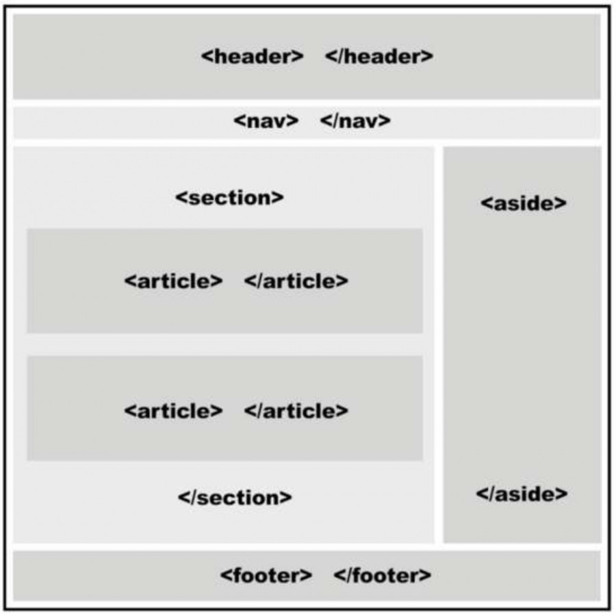

# Acerca de HTML

HTML es un lenguaje que se basa en etiquetas, las etiquetas tienen 6 niveles principales desde h1 hasta h6 que le indican al navegador la importancia en orden ascendente y el tamaño en que se muestra varia, letras mas grandes para h1 y mas pequeñas para h2.

tambien se pueden usar etiquetas de parrafo con "p", se pueden usar varias etiquetas p, y varias etiquetas h1 o h2... etc.

##  Estructurar el contenido 
Para agrupar las etiquetas podemos basarnos en el ejemplo de la siguiente imagen

establescamos algunas reglas 

- utilizamos section casi siempre que queramos agrupar los heads "h".
- Utilizamos main siempre que queramos especificar cual es el contenido principal de nuestra pagina